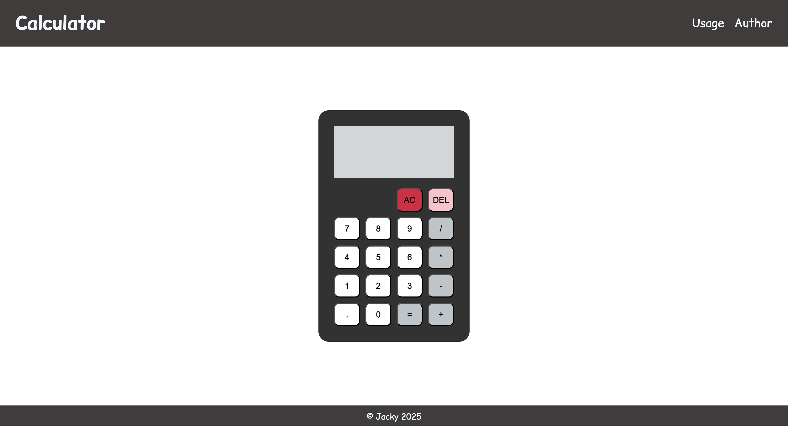

# Calculator

A simple, responsive calculator built with **HTML, CSS, and JavaScript** as part of [The Odin Project](https://www.theodinproject.com/lessons/foundations-calculator) Foundations course.

---

## User Interface

---

## Features

- Perform basic arithmetic operations:  
  - Addition `+`  
  - Subtraction `-`  
  - Multiplication `*`  
  - Division `/`  

- Keyboard support:  
  - Use number keys `0–9`  
  - `.` decimal point
  - Operators `+ - * /`  
  - `Enter` or `=` to evaluate  
  - `Backspace` to delete last entry  
  - `Escape` to clear everything  

- Display:  
  - Shows the full equation and the evaluated result  
  - Rounds results to 2 decimal places  
  - Handles division by zero with an `Error` message  

- Buttons:  
  - Number buttons `0–9`  
  - Operators `+ - * /`  
  - Decimal point `.`  
  - `AC` to clear all  
  - `DEL` to remove the last entry  
  - `=` to calculate

---

## Live Demo

You can try the [Calculator](https://jacky-jiaqi-w.github.io/calculator/) here.

---

## How to Use

1. Click the calculator buttons or use your keyboard to input numbers and operators.  
2. Press `=` or `Enter` to evaluate the current expression.  
3. Use `AC` or `Escape` to clear everything.  
4. Use `DEL` or `Backspace` to remove the last entry.

---

## Built With

- HTML5 for structure  
- CSS3 (Flexbox) for layout & styling  
- Vanilla JavaScript for functionality

